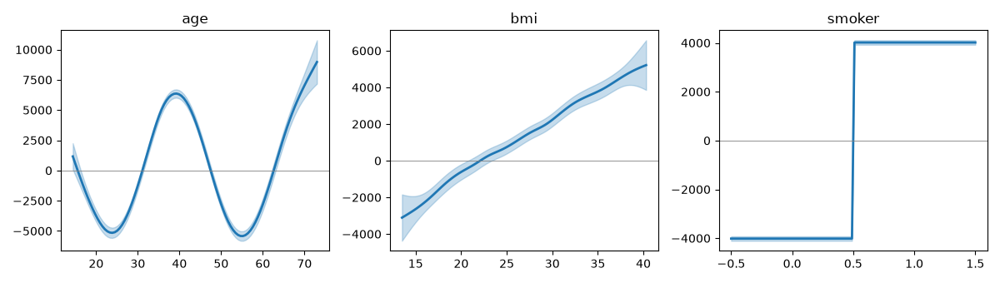
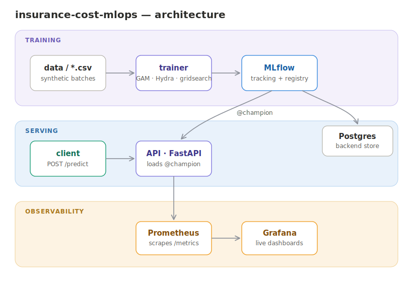
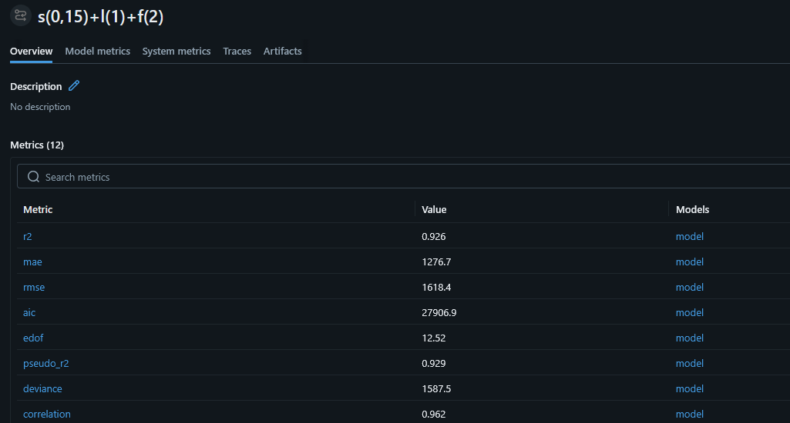
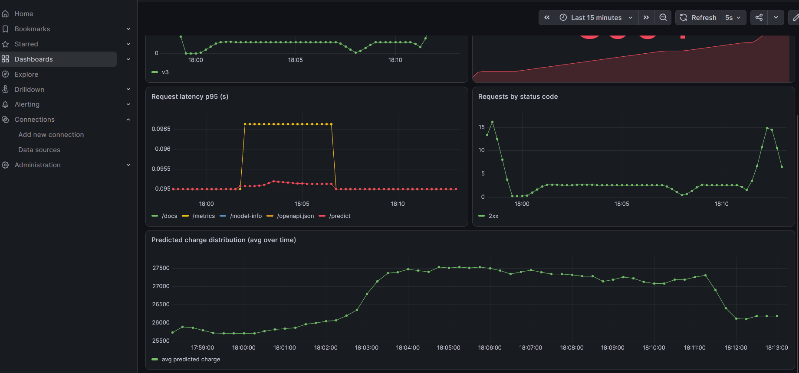

# Insurance Cost MLOps


An end-to-end MLOps pipeline that predicts insurance charges with an **Generalized Additive Model (GAM)**. This repo showcases the full lifecycle from configurable training (by means of Hydra) to a live prediction API, with experiment tracking, a model registry, drift monitoring, and observability dashboards.


---

## Overview

The project trains a GAM to predict insurance `charges` from `age`, `bmi` (linear ), and `smoker`, then **serves** as well as **monitors** it as a production-shaped system. This GAM was chosen over a black-box model because each feature's effect is **inspectable** - by means of partial effect plots (PEPs); these plots show the component effect of each of the smooth or linear terms in the **GAM** model, which add up to the overall prediction. 




The pipeline is fully **config-driven** (Hydra), **tracked and versioned** (MLflow), **served** over HTTP (FastAPI), **containerized** (Docker Compose), and **monitored** are two-fold: model/data drift (Evidently + statistical tests) and service health (Prometheus + Grafana).

---

## Architecture



Each piece is decoupled through the **MLflow model registry**: the trainer *writes* a champion's model, the API *reads* it by alias (`models:/insurance-cost@champion`). 

| Layer | Components |
|---|---|
| **Training** | `data/*.csv` → trainer (GAM, Hydra, gridsearch) → MLflow (tracking + registry), backed by Postgres |
| **Serving** | client → FastAPI (loads `@champion`) → prediction |
| **Observability** | API `/metrics` → Prometheus → Grafana; Evidently drift reports logged to MLflow |

---

## Key design decisions

- **GAM over black-box** -- interpretability. Each prediction decomposes into per-feature contributions (`intercept + splie(age, 15) + linear(bmi) + f(smoker)`).
- **Model selection by the Akaike information criterion (AIC)** -- the linear-bmi model (`s(0, n_splines=15)+l(1)+f(2)`) beat the spline-bmi variant on the AIC, for equivalent fit. BMI's effect is genuinely near-linear; spending flexibility on it was wasteful.
- **Champion / challenger registry** — models register as `@challenger`; promotion to `@champion` is an explicit, gated step. Serving always loads the current champion by alias (e..g., `v1`).
- **Drift attribution** — beyond a drift yes/no, per-feature statistical tests (Kolmogorov-Smirnov tests for `age` and `BMI`, the two-proportion Z-test for `smoker` since \in {0, 1}) identify *which* feature drifted and by how much.

---

## Project structure

```
insurance-cost-mlops/
├── conf/                       # Hydra configuration
│   ├── config.yaml             # defaults + data/gridsearch/registry settings
│   ├── model/                  # model term specs (swap with model=...)
│   ├── schema/                 # columns, target, categorical encoders
│   └── serve/                  # mlflow + monitor settings
├── src/
│   ├── config.py               # shared config loader (Hydra Compose API)
│   ├── train.py                # GAM training, metrics, diagnostics, registration
│   ├── serve.py                # FastAPI serving of the @champion model
│   └── monitor.py              # Evidently drift report
│   └── helper_functions        # some helper functions
├── monitoring/                 # prometheus.yml + grafana provisioning
├── tests/                      # pytest unit tests
├── docker-compose.yml          # postgres, mlflow, trainer, api, dashboard
└── docker/                     # Dockerfiles
```

---

## Quickstart

### Run the full stack (Docker)

```bash
docker compose up -d
```

This brings up Postgres, MLflow, the trainer (trains + registers its champion, then exits), the API, and the dashboard.

| Service | URL |
|---|---|
| Prediction API (Swagger) | http://localhost:8000/docs |
| MLflow UI | http://localhost:5555 |
| Grafana | http://localhost:3000 |
| Prometheus | http://localhost:9090 |

### Make a prediction

```bash
curl -X POST http://localhost:8000/predict \
  -H "content-type: application/json" \
  -d '{"age": 45, "bmi": 31.5, "smoker": "yes"}'
# -> {"charge": 34660.58, "model_version": "1"}
```

---

## Training

Config-driven via Hydra — override anything from the command line.

```bash
# default run — logs metrics, diagnostics, and the config to MLflow
python -m src.train

# compare models
python -m src.train -m model=age_spline_bmi_linear,age_spline_bmi_spline

# register a candidate as @challenger
python -m src.train registry.enabled=true model=age_spline_bmi_spline

# promote the winner to @champion (what serving loads)
python -m src.train registry.enabled=true registry.promote=true
```

Each run logs to MLflow: scalar metrics (`r2`, `mae`, `rmse`, `aic`, `edof`), per-term p-values, the full config as an artifact, and diagnostic plots (partial-effect curves with CI bands, residual diagnostics).

### MLflow tracking



---

## Drift monitoring

```bash
python -m src.monitor --current data/data_drift.csv --out reports/drift_report.html
```


---

## Observability

The API is instrumented with Prometheus metrics (request rate, latency, plus custom `predictions_total` and a predicted-charge histogram). Grafana visualizes them live.

The panel below shows the **average predicted charge rising as a drifted batch is served** — model behavior shift captured live, complementing the batch drift report.



---

## Testing

```bash
pytest
```

Unit tests cover the load-bearing serving logic — categorical encoding, training-time column order, prediction output, and input immutability — using a fake model so the tests need no MLflow or Docker.

---

## Tech stack

**ML & stats:** pygam | scikit-learn | statsmodels | pandas | NumPy
**MLOps:** MLflow · Hydra | Evidently | FastAPI | Docker Compose | PostgreSQL
**Observability:** Prometheus | Grafana | loguru
**Tooling:** uv pytest

---

## Notes

Data is **synthetic** (generated to control drift scenarios). The system is production-*shaped* — model registry, alias-based serving, containerization, monitoring — to demonstrate the MLOps lifecycle, not a production deployment.

## License

MIT
