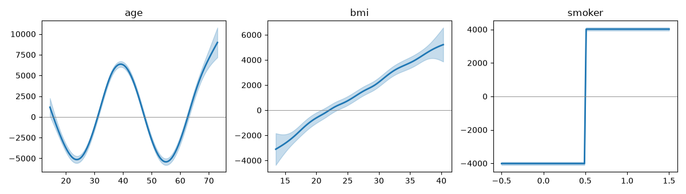
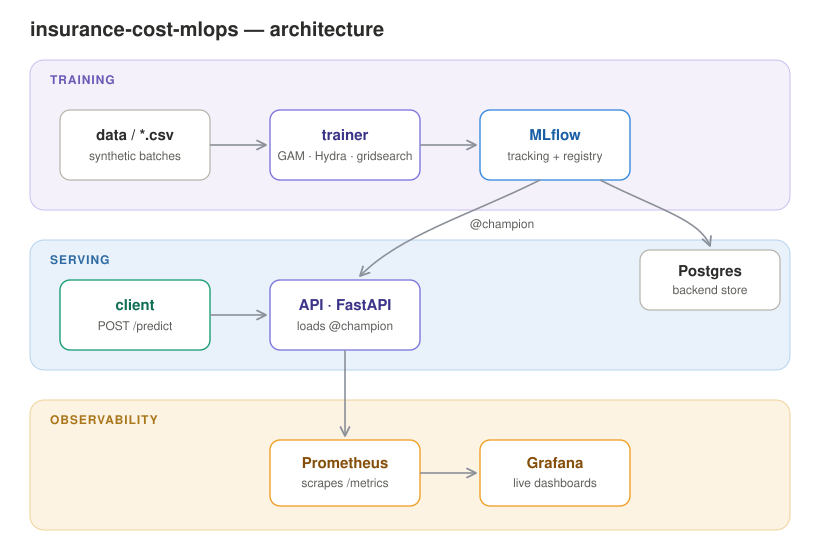
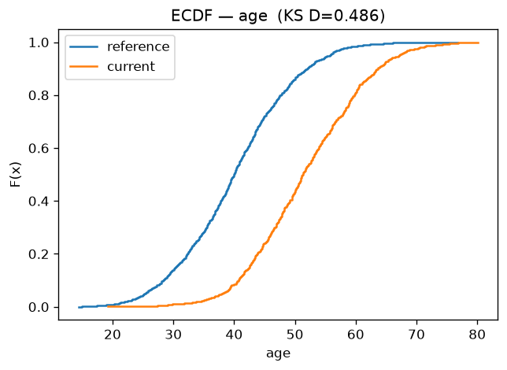
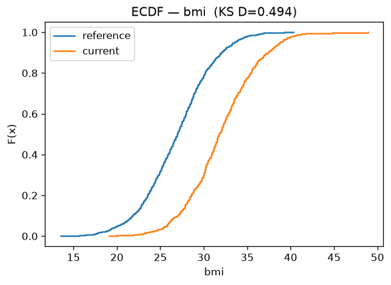
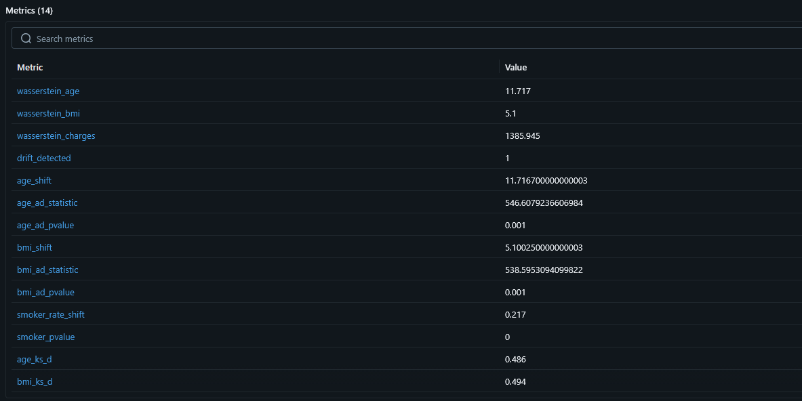
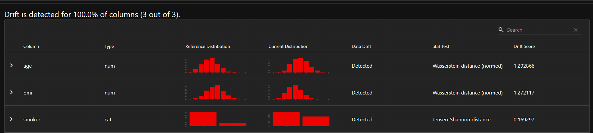
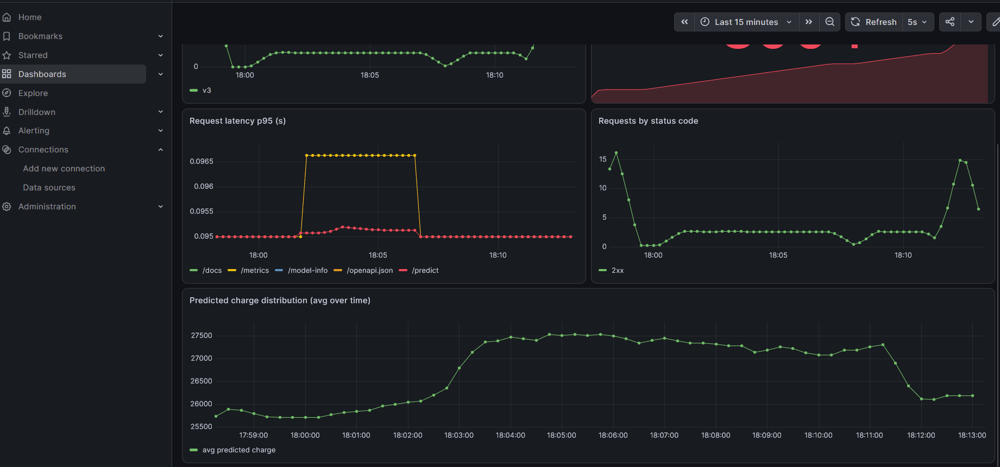

# Insurance Cost MLOps


[](https://github.com/fisherynwa/mlops-cycle/actions/workflows/ci.yml)


An end-to-end MLOps pipeline that predicts insurance charges via a **Generalized Additive Model (GAM)**. This repo showcases the full lifecycle from configurable training (by means of Hydra) to a (live) prediction API, including experiment tracking, a model registry, drift monitoring, and observability dashboards


---

## Overview

The project trains a GAM to predict insurance `charges` from `age`, `bmi` (linear), and `smoker`, then **serves** as well as **monitors** it as a production-shaped system. This GAM was chosen over a black-box model because each feature's effect is **inspectable**. Because the model is additive, each smooth contributes independently to the linear predictor, and its partial effect plot demonstrates each component (centered on its mean) regardless of the other terms' values. 



The pipeline is fully **config-driven** (Hydra), **tracked and versioned** (MLflow), **served** over HTTP (FastAPI), and **containerized (Docker Compose). Monitoring is two-fold: model/data drift (Evidently + statistical tests) and service health (Prometheus + Grafana).

---

## Architecture



Each piece is decoupled through the **MLflow model registry**: the trainer *writes* a champion's model, the API *reads* it by alias (`models:/insurance-cost@champion`). 

| Layer | Components |
|---|---|
| **Training** | `data/*.csv` → trainer (GAM, Hydra, gridsearch) → MLflow (tracking + registry), backed by Postgres |
| **Serving** | client → FastAPI (loads `@champion`) → prediction |
| **Observability** | API `/metrics` → Prometheus → Grafana; Evidently drift reports logged to MLflow |

---

## Key design decisions

- **GAM over black-box** -- interpretability. Each prediction decomposes into per-feature contributions (`intercept + s(age) + linear(bmi) + f(smoker)`).
- **Model selection by the Akaike information criterion (AIC) and `EDoF`** -- the linear-bmi (in-sample) model (`s(0, n_splines=15)+l(1)+f(2)`) beat the spline-bmi variant in the AIC context and the `EDoF` estimation, for an equivalent fit. BMI's effect is genuinely near-linear (by its simulation).
- **Champion / challenger registry** — models register as `@challenger`; promotion to `@champion` is an explicit, gated step. Serving always loads the current champion by alias (e.g., `v1`).
- **Drift attribution** (two layers)-- beyond a yes/no drift verdict, the raw (unstandardized) Wasserstein distance reports (on the MLflow page) the magnitude of shift per numeric feature, while per-feature statistical tests drive the decision: a two-sample Anderson–Darling test for `age` and `bmi` (more sensitive than the KS to differences in the tails of the distribution; check out the "/docs/ks_vs_ad_power.png" plot), and a two-proportion Z-test for the binary `smoker`. The ECDF (empirical cumulative density function)  (with its KS gap) is logged for each numeric feature as a visual diagnostic alongside their (hypothesis) tests.


<p align="center">
  
  
</p>
---

## Project structure

```
insurance-cost-mlops/
├── conf/                       # Hydra configuration
│   ├── config.yaml             # defaults + data/gridsearch/registry settings
│   ├── model/                  # model term specs (swap with model=...)
│   ├── schema/                 # columns, target, categorical encoders
│   └── serve/                  # mlflow + monitor settings
├── src/
│   ├── config.py               # shared config loader (Hydra Compose API)
│   ├── train.py                # GAM training, metrics, diagnostics, registration
│   ├── serve.py                # FastAPI serving of the @champion model
│   └── monitor.py              # Evidently drift report
│   └── helper_functions        # some helper functions
├── monitoring/                 # prometheus.yml + grafana provisioning
├── tests/                      # pytest unit tests
├── docker-compose.yml          # postgres, mlflow, trainer, api, dashboard
└── docker/                     # Dockerfiles
```

---

## Quickstart

### Run the full stack (Docker)

```bash
docker compose up -d
```

This brings up Postgres, MLflow, the trainer (trains + registers its champion, then exits), the API, and the dashboard.

| Service | URL |
|---|---|
| Prediction API (Swagger) | http://localhost:8000/docs |
| MLflow UI | http://localhost:5555 |
| Grafana | http://localhost:3000 |
| Prometheus | http://localhost:9090 |

### Make a prediction

```bash
curl -X POST http://localhost:8000/predict \
  -H "content-type: application/json" \
  -d '{"age": 45, "bmi": 31.5, "smoker": "yes"}'
# -> {"charge": 34660.58, "model_version": "1"}
```

---

## Training

Config-driven via Hydra — override anything from the command line.

```bash
# default run — logs metrics, diagnostics, and the config to MLflow
python -m src.train

# compare models
python -m src.train -m model=age_spline_bmi_linear,age_spline_bmi_spline

# register a candidate as @challenger
python -m src.train registry.enabled=true model=age_spline_bmi_spline

# promote the winner to @champion (what serving loads)
python -m src.train registry.enabled=true registry.promote=true
```

Each run logs to MLflow: scalar metrics (`r2`, `mae`, `rmse`, `aic`, `edof`, `deviance`, `pseudo R2`), per-term p-values, the full config as an artifact, and diagnostic plots (partial-effect curves with CI bands and residual diagnostics).

### MLflow tracking



---

## Drift monitoring

```bash
python -m src.monitor --current data/data_drift.csv --out reports/drift_report.html
```




---

## Observability

The API is instrumented with Prometheus metrics (request rate, latency, plus custom `predictions_total` and a predicted-charge histogram). Grafana visualizes them live.

The panel below shows the **average predicted charge rising as a drifted batch is served** — a model behavior shift captured live, complementing the batch drift report.



---

## Testing

```bash
pytest
```

---

## Tech stack

**ML & stats:** pygam | scikit-learn | statsmodels | pandas | NumPy
**MLOps:** MLflow · Hydra | Evidently | FastAPI | Docker Compose | PostgreSQL
**Observability:** Prometheus | Grafana | loguru
**Tooling:** uv pytest

---

## Notes

First, the data presented is **synthetic** (generated to control drift scenarios). The system is production-*shaped* — model registry, alias-based serving, containerization, monitoring — to demonstrate the MLOps lifecycle, not a production deployment.

Second, this repo uses pygam for GAM parameter estimation. `pygam` is a pure-Python implementation (scikit-learn-style API), so it does not need `R` runtime. To this end, the `pygam` choice keeps the container lightweight and the pipeline reproducible, a natural fit for this `MLOps` setup.

A more statistically advanced option is `pymgcv`, a Python interface to Prof. Simon Wood's `mgcv` package (in `R`). The latter exposes automatic smoothness selection (REML/GCV/ML; smoothing parameters estimated jointly), but because it calls `R` under the hood it requires an `R` installation alongside Python.

Having said that, some comparisons were carried out to confirm "closely matching" estimations across `pygam` and `mgcv`. Notice that
`mgcv` estimates a separate smoothing parameter (viz. `lambda` in the `pygam` context) for each covariate, jointly and automatically. The covariate lambda search added here is the pygam-side approximation of that behavior. 

## Deployment (Google Cloud)

Stage 1 deploys the same `docker-compose.yml` stack unmodified onto a single Compute Engine VM, with only the prediction API exposed to the internet.

### 1. Create the VM

```bash
gcloud compute instances create insurance-mlops-vm \
  --zone=us-central1-a \
  --machine-type=e2-medium \
  --image-family=ubuntu-2204-lts \
  --image-project=ubuntu-os-cloud \
  --boot-disk-size=30GB \
  --boot-disk-type=pd-balanced \
  --tags=mlops-api
```

The `mlops-api` network tag is what the firewall rule below targets, so only this VM (not the whole network) gets port 8000 opened.

### 2. Open only port 8000

```bash
gcloud compute firewall-rules create allow-mlops-api-8000 \
  --network=default \
  --direction=INGRESS \
  --action=ALLOW \
  --rules=tcp:8000 \
  --source-ranges=0.0.0.0/0 \
  --target-tags=mlops-api
```

No other port is opened to the internet. SSH access uses IAP tunneling instead of a firewall-opened port 22:

```bash
gcloud compute firewall-rules create allow-ssh-iap \
  --network=default \
  --direction=INGRESS \
  --action=ALLOW \
  --rules=tcp:22 \
  --source-ranges=35.235.240.0/20   # Google's fixed IAP TCP-forwarding range
```

If your project still has the default `default-allow-ssh` / `default-allow-rdp` rules (created automatically with the `default` network), delete them so SSH/RDP aren't reachable from the open internet:

```bash
gcloud compute firewall-rules delete default-allow-ssh default-allow-rdp
```

### 3. SSH in via IAP, install Docker

```bash
gcloud compute ssh insurance-mlops-vm --zone=us-central1-a --tunnel-through-iap
```

Then, on the VM:

```bash
sudo apt-get update
sudo apt-get install -y ca-certificates curl gnupg git
sudo install -m 0755 -d /etc/apt/keyrings
curl -fsSL https://download.docker.com/linux/ubuntu/gpg | sudo gpg --batch --yes --dearmor -o /etc/apt/keyrings/docker.gpg
sudo chmod a+r /etc/apt/keyrings/docker.gpg
echo "deb [arch=$(dpkg --print-architecture) signed-by=/etc/apt/keyrings/docker.gpg] https://download.docker.com/linux/ubuntu $(. /etc/os-release && echo "$VERSION_CODENAME") stable" | sudo tee /etc/apt/sources.list.d/docker.list > /dev/null
sudo apt-get update
sudo apt-get install -y docker-ce docker-ce-cli containerd.io docker-buildx-plugin docker-compose-plugin
sudo usermod -aG docker "$USER"
```

### 4. Clone the repo and bring up the stack

```bash
git clone https://github.com/fisherynwa/mlops-cycle.git ~/mlops-cycle
cd ~/mlops-cycle
sudo docker compose up -d
```

`trainer` runs once, trains and registers the champion model, then exits; `api` waits for it to finish successfully (`depends_on: service_completed_successfully`) before starting.

### 5. Watch training finish, then verify `/predict`

```bash
sudo docker compose logs -f trainer   # wait for it to exit 0
sudo docker compose ps                # confirm `api` is Up
```

From your own machine, against the VM's external IP:

```bash
curl http://<EXTERNAL_IP>:8000/health
curl -X POST http://<EXTERNAL_IP>:8000/predict \
  -H "content-type: application/json" \
  -d '{"age": 45, "bmi": 30.5, "smoker": "yes"}'
# -> {"charge": 34660.58, "model_version": "1"}
```

### Cost control

The VM (and its disk) keeps billing while it exists, whether or not the stack is running. Stop it when you're not using it:

```bash
gcloud compute instances stop insurance-mlops-vm --zone=us-central1-a
```

A stopped instance drops the compute charge (only the ~30GB persistent disk keeps billing, a few cents/month). Restart with:

```bash
gcloud compute instances start insurance-mlops-vm --zone=us-central1-a
```

Note the external IP is ephemeral by default and will change on restart unless you reserve a static one. To tear everything down instead:

```bash
gcloud compute instances delete insurance-mlops-vm --zone=us-central1-a
gcloud compute firewall-rules delete allow-mlops-api-8000 allow-ssh-iap
```

## License

MIT
